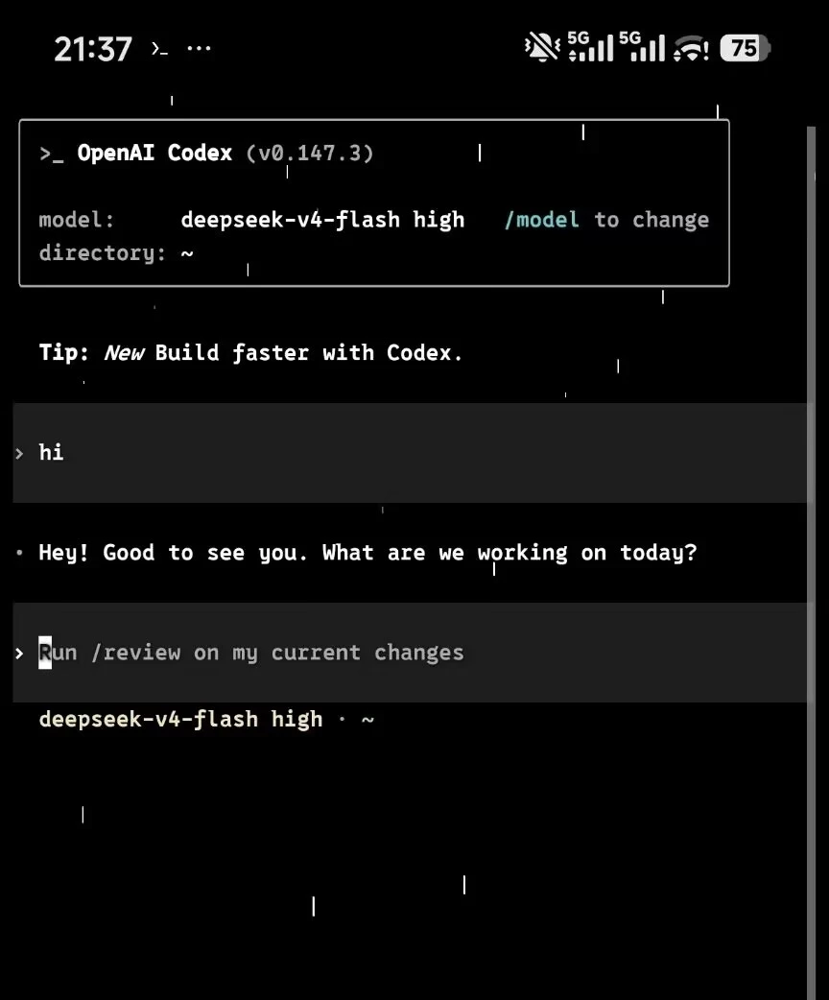

# Android Termux 智能体一键安装助手

安卓手机专用，面向 Android ARM64 Termux 的 Codex 和 Claude Code 一键安装、更新与配置脚本。

## 一键运行

在 Termux 中执行：

```bash
curl -fsSL https://github.com/LaranjaPeixe/android-termux-agent-installer/raw/refs/heads/main/install.sh | bash
```

如果网络不稳定或管道执行时无法正常交互，请先下载再运行：

```bash
curl -fL https://github.com/LaranjaPeixe/android-termux-agent-installer/raw/refs/heads/main/install.sh -o install.sh
bash install.sh
```

## 环境要求

- Android ARM64/aarch64 设备
- 支持任意可正常使用 `pkg` 和 `npm` 的 Termux，包括 Zero Termux
- 首次安装需要网络连接
- 首次运行会自动执行 `pkg update` 和 `pkg upgrade` 初始化软件包环境

## 主要功能

- 安装或更新 Termux 适配版 Codex
- 安装或更新 Termux 适配版 Claude Code
- 自动补齐依赖，官方源失败后自动尝试国内镜像
- 配置 Codex 和 Claude Code 的端点、密钥与模型
- 测试 OpenAI 兼容中转连接并获取模型列表
- Codex 接入 DeepSeek，或恢复此前保存的中转配置
- 环境诊断和固定 `.Bak` 配置备份

安装 Codex 后可以选择 ChatGPT 官方登录、中转站或 DeepSeek。DeepSeek API Key 需要自行前往 [DeepSeek 开放平台](https://platform.deepseek.com/api_keys)申请。

## DeepSeek 成功示例



## 常用命令

```text
codex       启动 Codex
claude      启动 Claude Code
/model      在智能体中选择模型
/resume     恢复历史对话
```

## 相关项目

- Codex 上游项目：[OpenAI Codex](https://github.com/openai/codex)
- Codex Termux 适配：[DioNanos/codex-termux](https://github.com/DioNanos/codex-termux)，安装包 `@mmmbuto/codex-cli-termux`
- Claude Code 上游项目：[Anthropic Claude Code](https://github.com/anthropics/claude-code)
- Claude Code Termux 适配：[XurXuo / DamnSit](https://github.com/DamnSit/claude-code-termux)，安装包 `@xurxuo/claude-code-termux`

## 安全说明

仓库和脚本不包含任何私人端点或 API Key。你输入的配置只保存在自己的 Termux 主目录中，请勿把 `~/.codex`、`~/.claude` 或含密钥的配置文件上传到公开仓库。

## 开源许可

本项目采用 [MIT License](LICENSE)，任何人均可使用、修改和分发。
